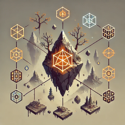

<p align="center">
  
</p>

<h1 align="center">Valheim-Prime</h1>

<p align="center">
  <a href="https://github.com/Slatyo/Valheim-Prime/releases"></a>
  <a href="https://opensource.org/licenses/MIT"></a>
</p>

<p align="center">
  The foundational combat and stats engine for the Valheim mod ecosystem.<br>
  Stats, modifiers, abilities, damage pipeline, effects, and events.
</p>

## Features

- **Stat System** - Define and track any stats (Strength, Health, Armor, etc.)
- **Modifier System** - Apply flat, percentage, or multiplicative bonuses with stacking
- **Timed Modifiers** - Buffs and debuffs that expire automatically
- **Ability System** - Define abilities with cooldowns, costs, and effects
- **Damage Pipeline** - Full damage calculation with crit, armor, resistances
- **Effect System** - DoTs, procs, on-hit effects, on-damage-taken triggers
- **Formula Overrides** - Mods can override any combat formula
- **Events** - Subscribe to stat changes, combat events, ability events

## Installation

### Thunderstore (Recommended)
Install via [r2modman](https://valheim.thunderstore.io/package/ebkr/r2modman/) or [Thunderstore Mod Manager](https://www.overwolf.com/app/Thunderstore-Thunderstore_Mod_Manager).

### Manual
1. Install [BepInEx](https://valheim.thunderstore.io/package/denikson/BepInExPack_Valheim/)
2. Install [Jotunn](https://valheim.thunderstore.io/package/ValheimModding/Jotunn/)
3. Place `Prime.dll` in `BepInEx/plugins/`

**Note:** All players and the server must have the mod installed.

## For Mod Developers

Prime is designed as the foundation for other mods. See the [API Documentation](Prime/README.md) for:

- Registering custom stats
- Adding modifiers with stacking behaviors
- Creating abilities with cooldowns and costs
- Implementing on-hit and on-damage-taken effects
- Overriding combat formulas
- Subscribing to events

## Console Commands

```
prime stats              - Show all stats
prime get Strength       - Get specific stat
prime set Strength 25    - Set base value
prime mod add Str flat 10 - Add modifier
prime ability test       - Register test abilities
prime effect test        - Apply test effects
prime damage 50 fire     - Deal test damage
```

## Ecosystem

Prime is part of the Valheim mod ecosystem:

- **Viking** - Player classes and talents
- **Denizen** - Creature stats and AI abilities
- **Loot** - Item affixes and legendary effects
- **Enchanting** - Enchantment stat bonuses
- **Rift** - Dungeon scaling and boss mechanics

## Contributing

See [CONTRIBUTING.md](CONTRIBUTING.md) for development setup and guidelines.

## Acknowledgments

- Built using [JotunnModStub](https://github.com/Valheim-Modding/JotunnModStub) template
- Powered by [Jötunn](https://valheim-modding.github.io/Jotunn/) - the Valheim Library
- [BepInEx](https://github.com/BepInEx/BepInEx) - Unity game patcher and plugin framework

## License

[MIT](LICENSE) © Slatyo
